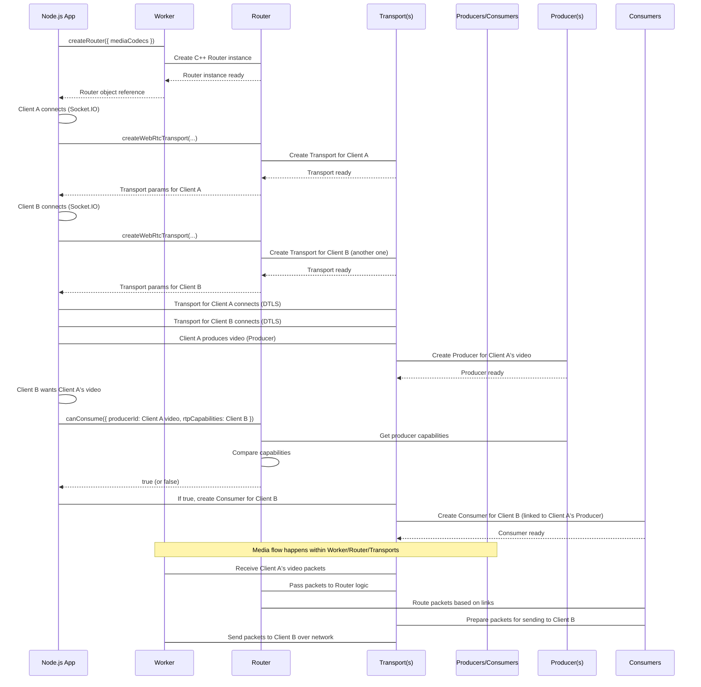

# 🎥 Real-Time Video Calling with Mediasoup

A real-time video calling application built with **Node.js**, **Socket.IO**, and **mediasoup**, supporting multi-user rooms with WebRTC.
The backend handles SFU routing using mediasoup, while the frontend connects participants, manages streams, and enables seamless audio/video communication.

---

## 🚀 Features

- **Multi-User Rooms** — Create or join video conferencing rooms.
- **Low-Latency Streaming** — Powered by mediasoup’s SFU architecture.
- **Dynamic Room Management** — Create routers and transports per room.
- **Real-Time Signaling** — Using Socket.IO for connection coordination.
- **Scalable Architecture** — Supports multiple simultaneous rooms.
- **Easy Integration** — Modular code structure for backend and frontend.

---

## 🛠 Tech Stack

**Backend**

- Node.js
- Express
- Socket.IO
- mediasoup

**Frontend**

- React / Next.js (or your chosen FE framework)
- WebRTC APIs
- Socket.IO Client

---

## ⚙️ Installation

1. **Clone the Repository**

   ```bash
   git clone https://github.com/M-Abdullah-Q/msp.git
   cd msp
   ```

2. **Install Dependencies**

   ```bash
   cd server
   npm install
   cd ../web2
   npm install
   ```

3. **Configure mediasoup**
   - Open `server/config.js`
   - Set your desired **listen IP**, **announced IP**, and other mediasoup settings.

4. **Run the Server**

   ```bash
   cd server
   npm run dev
   ```

5. **Run the Client**

   ```bash
   cd client
   npm run dev
   ```

---

## 🔌 How It Works



1. **Signaling Phase**
   Clients connect to the backend via Socket.IO for exchanging **RTP capabilities** and session details.

2. **Room Creation**
   - On joining a room, the server creates a **Router** in mediasoup for that room.
   - Each client creates **SendTransport** and **RecvTransport**.

3. **Media Exchange**
   - Clients produce their audio/video streams.
   - Other clients consume these streams via the mediasoup SFU.

4. **Real-Time Updates**
   - Joining/leaving events are broadcasted via Socket.IO.
   - Consumers are dynamically updated to reflect participant changes.

---

## 📜 Example `.env`

```env
PORT=5000
LISTEN_IP=0.0.0.0
ANNOUNCED_IP=your-public-ip
MEDIASOUP_LISTEN_PORT=3000
```

---

## 🧩 Future Improvements

- Add **screen sharing**.
- Implement **chat alongside video**.
- Improve UI for participant grid.
- Deploy to cloud with TURN/STUN for NAT traversal.
